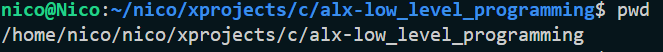
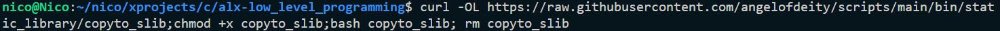
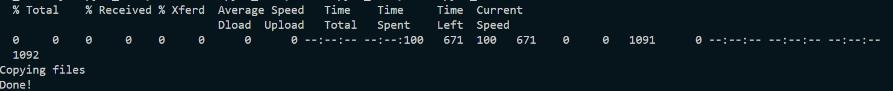
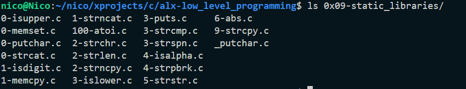

# Script to Copy all files required into `0x09-static_libraries`
This script copies all the files required for the static library project into the required folder `0x09-static_libraries`
## Usage
To copy the files to `0x09-static_libraries`
1. navigate to `alx-low_level_programming`
2. confirm that you're in the right directory
   
3. The following code must be executed while in the directory:  `alx-low_level_programming`
~~It will not work otherwise~~.
4. Copy this code to run the script directly in one step:
	- How it will look once u copy the command into your terminal:
  		
  
  	> ```curl -OL https://raw.githubusercontent.com/angelofdeity/scripts/main/bin/static_library/copyto_slib;chmod +x copyto_slib;bash copyto_slib; rm copyto_slib```

   - How it will look after u click Enter:
  	
5. Final step:
	Confirm that the files have been copied
	

Next steps??...
Read this article to learn how to build your static library
[C Static Libraries — What, Why, and How?](https://medium.com/@bdov_/https-medium-com-bdov-c-static-libraries-what-why-and-how-b6b442b054d3)
  
